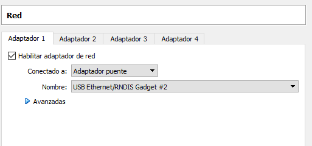
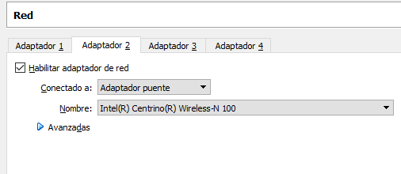

# Give Internet connection through USB to Pi-Zero-W  
  
## Connect over USB
First thing to do is to configure ethernet-over-usb connection to raspberry pi.  
I've just used one of the tutorials found on google. One important thing about this step is that my OS didn't detect   
the Pi Zero as a device, so I searched for a driver someone provided for the same problem. Can be found in driver folder   
## Install private key  
  Added a private key for comodity to the raspberry pi and I use it for ssh connections.  
  
## Create VM with 2 interfaces.  
  Installed an Ubuntu Server 14.04 with two interfaces:
  1st interface must be configured while Pi-Zero-W is connected as an RNDIS device:  
    
    
  2nd interface is for the VM, so that it can have Internet connection.It's in the BRIDGED MODE  
    
  ## VM Network Configuration  
  ### Configure the adapters  
  It's the "/etc/network/interfaces" file.  
```
# This file describes the network interfaces available on your system
# and how to activate them. For more information, see interfaces(5).

# The loopback network interface
auto lo
iface lo inet loopback

# The primary network interface
auto eth1
iface eth1 inet static
address 192.168.10.200
netmask 255.255.255.0
gateway 192.168.10.1
dns-nameservers 8.8.8.8

auto eth0
iface eth0 inet static
address 192.168.3.1
netmask 255.255.255.0
```  
  
### Configure routing  
The next rules seem to work fine. iptables-persistent package needs to be installed  
Make sure using superuser account  

```
iptables -F
iptables -X
iptables -t nat -F
iptables -t nat -X
iptables -t mangle -F
iptables -t mangle -X
iptables -P INPUT ACCEPT
iptables -P FORWARD ACCEPT
iptables -P OUTPUT ACCEPT
echo "1" >/proc/sys/net/ipv4/ip_forward

iptables -t nat -A POSTROUTING -s 192.168.3.0/24 -o eth1 -j MASQUERADE
iptables -A FORWARD -s 192.168.3.0/24 -o eth1 -j ACCEPT
iptables -I INPUT -s 192.168.3.0/24 -m state --state ESTABLISHED,RELATED -j ACCEPT

iptables -t nat -A POSTROUTING -s 192.168.10.0/24 -o eth0 -j MASQUERADE
iptables -A FORWARD -s 192.168.10.0/24 -o eth0 -j ACCEPT
iptables -I INPUT -s 192.168.10.0/24 -m state --state ESTABLISHED,RELATED -j ACCEPT

sudo netfilter-persistent save
#sudo service iptables-persistent save
```  
  
 ## Pi Zero Configuration  
 Configure the usb network adapter so that it's in the same network as VM.  
 The only part modified here is the usb0 part at the end.  
```
# interfaces(5) file used by ifup(8) and ifdown(8)

# Please note that this file is written to be used with dhcpcd
# For static IP, consult /etc/dhcpcd.conf and 'man dhcpcd.conf'

# Include files from /etc/network/interfaces.d:
source-directory /etc/network/interfaces.d

auto lo
iface lo inet loopback

iface eth0 inet manual

allow-hotplug wlan0
iface wlan0 inet manual
    wpa-conf /etc/wpa_supplicant/wpa_supplicant.conf

allow-hotplug wlan1
iface wlan1 inet manual
    wpa-conf /etc/wpa_supplicant/wpa_supplicant.conf

allow-hotplug usb0
auto usb0
iface usb0 inet static
address 192.168.3.141
netmask 255.255.255.0
gateway 192.168.3.1
dns-nameservers 8.8.8.8
```  
## DHCP
Install DHCP
```
sudo apt-get install isc-dhcp-server
```  
Configure interface
```
sudo nano -c /etc/default/isc-dhcp-server
```  
Configure dhcp network
```
sudo nano -c /etc/dhcp/dhcpd.conf
```  
The configuration for dhcp to copy at the end
```  
subnet 192.168.3.0 netmask 255.255.255.0 {  #network
	range 192.168.3.50 192.168.3.100; # Range
	option domain-name-servers 8.8.8.8; #Pri DNS , Sec DNS
	option domain-name "lintut.com"; #Domain name 
	option routers 192.168.3.1; #Gateway
	option broadcast-address 192.168.3.255; #Broadcast
	default-lease-time 600;
	max-lease-time 7200;
}

```  
Looks like thats it.  
Shutdown the VM and Pi Zero.  
Turn on the PiZero and then power up the VM, elsewise the VirtualBox will not detect the device's network properly.  
